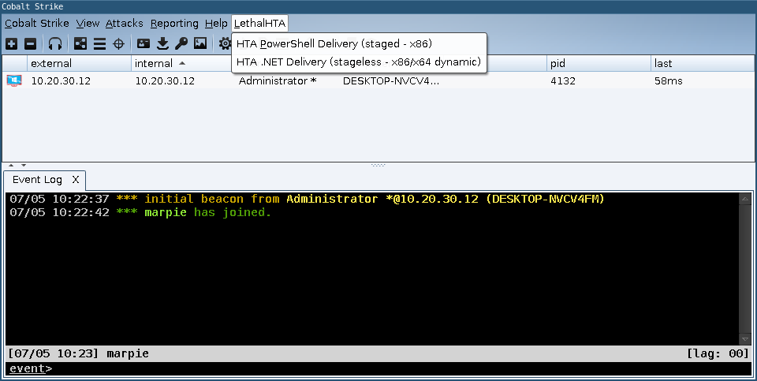
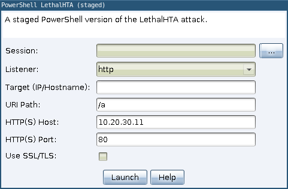
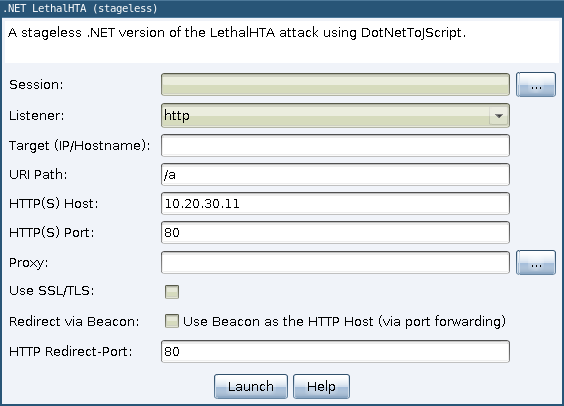
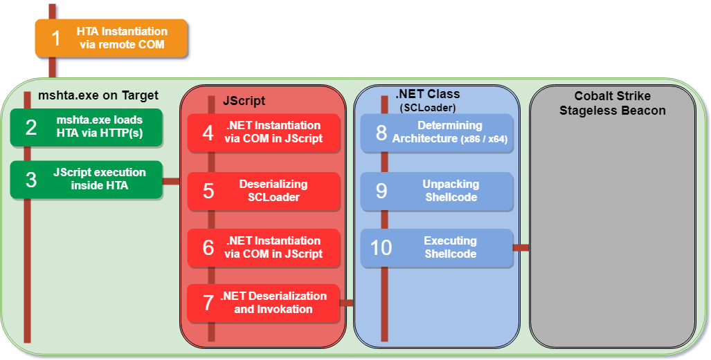

# LethalHTA.NET CobaltStrike Integration

The CobaltStrike Aggressor Script *lethalhta.cna* provides two lateral-movement options that use the LethalHTA attack vector.

 * *HTA PowerShell Delivery (staged - x86)* and 
 * *HTA .NET In-Memory Delivery (stageless - x86/x64 dynamic)*

## HTA PowerShell Delivery (staged - x86)

The *HTA PowerShell Delivery* methods allows to execute a PowerShell based, staged Beacon on the target system via HTA over COM using the *LethalHTADotNet* tool.

*Hint:* Since the PowerShell beacon is staged, the target systems need to be able to reach the HTTP(S) host and TeamServer (in most cases this is the same).

## HTA .NET In-Memory Delivery (stageless - x86/x64 dynamic)

The *HTA .NET Delivery* provides far more flexibility in terms of payload delivery and stealth. Not only it is possible to tunnel the HTA delivery/retrieval process through the Beacon systems, but also to specify a proxy server. If the target system is not able to reach the TeamServer or any other Internet-connected system a *SMB* listener can be used. This bootstraps the SMB-listener on the target and the operator is now able to connect to the target via linking (`link <target-ip>`) the two beacons.

In addition due to the techniques used, everything is done in the *mshta.exe* process without ever touching disk or creating additional processes.

### Delivery Overview

The combination of two techniques, in addition to the HTA attack vector, is needed to execute everything in-memory. Utilizing the excellent [*DotNetToJScript*](https://github.com/tyranid/DotNetToJScript) tool by James Forshaw, we are able to load a small .NET class (*SCLoader*) that dynamically determines the processes architecture (x86 or x64) and then executes the included stageless Beacon shellcode.

As shown in the figure above the HTA object is created on the target system via COM (step 1). Then the target retrieves the HTA file via HTTP (step 2) and executes the included JScript (step 3) inside *mshta.exe*. Steps 4 - 7 are the normal *DotNetToJScript* execution mode. The class loaded by step 7 (*SCLoader*) determines the current processes architecture (step 8), decompresses the right shellcode (step 9) and executes it in the same process by creating a new Thread (step 10).

As the required 32- and 64-bit shellcode of the Beacons need to be generated on-the-fly by the CobaltStrike Client, the output of *DotNetToJScript* needs to be modified, so the Aggressor Script is able to inject the right shellcode into SCLoader before delivery. The SCLoader output generated by *DotNetToJScript* needs to be split into a template HTA file (*dotNetJScriptTemplate.js*) that contains the code to load the .NET Framework and our *SCLoader* class. And another file *SCLoader.bin* containing the Base64-decoded content of the variable *serialized_obj* of *DotNetToJScript*.

The following command line can be used to create the output file *SCLoaderOuput.js*. Afterwards the content of *serialized_obj* needs to be Base64-decoded and stored in the file *SCLoader.bin*.

	DotNetToJScript.exe -d -l JScript -v Auto -o SCLoaderOuput.js -c SCLoader.SCLoader SCLoader\SCLoader\bin\Release\SCLoader.dll
